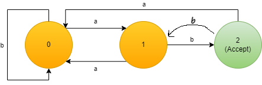

# Compiler Design

## What is this about ?

I created this repository for my university class, `Compiler Design`.

Useful for:
- Those who have compiler class
- Those who like to read about compilers
- And those who like to explore the world

As I'm still compiler class student, content of this repository will update with my knowledge progress. So, be my guest, take your sit and enjoy your journey.

## Warm Up

- ### What is compiler?
- Compiler is a program that translates high language codes into instructions that can be undrestood by CPU.

## What is DFA ?

`DFA = Deterministic Finite Automata`

DFA is a machine that create determinited finite expressions.

Each machine is composed of States. Each States specifies what can be made by machine. Also there is one or more accept states which can accept the created word. If expression ends outside of accept state, machine returns error.

Look at below picture:



This machine starts with state 0. 
On `state 0`, by 'a' moves to state 1 and by 'b' stay on itself.
On `state 1`, by 'a' moves to state 0 and by 'b' moves to state 2.
On `state 2`, it can accept the expression or back to state 0 by 'a'.

We can end up with these results:
- This machine could start with infinite b or just a.
- Machine could return back to state 0 if starts with a.
- This machine accepts the expressions which are end with ab.

Examples: 
`[ab], [bab], [bbab], [bbbab], [baaab], [baabab], [baabaabbab], [babaaabbbab]`

## How to use?

Good Question!

First of all, clone this repository by: 
```cmd
git clone https://github.com/Codidodido/compiler-design.git
```

- #### How to create a machine:
    ```python
    # machine = {state:[[next-state,char],...],...}
    # example: 
    machine = {0:[[1,'a'],[0,'b']],1:[[0,'a'],[2,'b']],2:[[0,'a'],"end"]}
    ```
    !: Accept state has "end" value

- #### How to use DFA module:
    ```python
    import DFA

    # DFA.dfa(machine,exp)

    machine = {0:[[1,'a'],[0,'b']],1:[[0,'a'],[2,'b']],2:[[0,'a'],"end"]}
    exp = "babaaabbbab"
    exp2 = "babaaabbbaba"
    print(DFA.dfa(machine,exp)) # True
    print(DFA.dfa(machine,exp2)) # False
    ```